# Procesverslag
Markdown is een simpele manier om HTML te schrijven.  
Markdown cheat cheet: [Hulp bij het schrijven van Markdown](https://github.com/adam-p/markdown-here/wiki/Markdown-Cheatsheet).

Nb. De standaardstructuur en de spartaanse opmaak van de README.md zijn helemaal prima. Het gaat om de inhoud van je procesverslag. Besteedt de tijd voor pracht en praal aan je website.

Nb. Door *open* toe te voegen aan een *details* element kun je deze standaard open zetten. Fijn om dat steeds voor de relevante stuk(ken) te doen.

## Jij

  
uitwerken voor kick-off werkgroep

  ### Auteur:
  Suze Kersbergen

  #### Je startniveau:
  blauw 

  #### Je focus:
  responsive
 

## Je website

  
uitwerken voor kick-off werkgroep

  ### Je opdracht:
  https://www.asos.com/nl/dames/ 

  #### Screenshot(s) van de eerste pagina (small screen): 
  hier de naam van de pagina  
  
  Dit is de homepage van Asos, een website die heel veel kleding, accesoires en schoenen verkoopt. De site is bekend en ik vond deze site geschikt door de variatie van de content. 

  #### Screenshot(s) van de tweede pagina (small screen):
  hier de naam van de pagina  
  
  De pagina is de omschijving van een bepaald product, ik zal waarschijnlijk niet de pagina van dit exacte product gebruiken maar de content is op elke productpagina hetzelfde. 
 

## Toegankelijkheidstest 1/2 (week 1)

  
uitwerken na test in 2e werkgroep

  Ik heb de site door een validator gehaald, de validator gaf al gelijk een error aan dat het niet mogelijk was om de site te checken. Uiteindelijk is dit wel gelukt door de code direct in de validator te plakken. 

  ### Bevindingen
  Lijst met je bevindingen die in de test naar voren kwamen:
  - De code bevat meer dan 700 errors, veel dezelfde fouten worden gemaakt zoals een alt tekst die ontbreekt of een div verkeerd gebruikt.
  - De site heeft een knop waarmee je kan skippen tot de inhoud, dit is handig voor een screenreader. Ook was deze functie niet makkelijk te vinden en kwam ik hier perongeluk op.
  - De menu is erg groot en heel lastig om met een screenreader doorheen te gaan. 
  - Af en toe slaat de screenreader een onderdeel over dus zullen deze elementen waarschijnlijk geen alt tekst bevatten.

 
  
  

## Breakdownschets (week 1)

  
uitwerken na afloop 3e werkgroep

  ### de hele pagina: 
  
  Op de pagina is er veel dezelfde content te zien, ik wil elk deel er wel inzitten maar in verminder de hoeveelheid van bijvoorbeeld een lijst.

  ### dynamisch deel (bijv menu): 
  

  ### wellicht nog een dynamisch deel (bijv filter): 
  

## Voortgang 1 (week 2)

  
uitwerken voor 1e voortgang

  ### Stand van zaken
   Deze week ben ik begonnen met mijn html document. Ik merkte dat veel van de stof van vorig jaar was weggezakt zoals hoe de tags ook alweer heten. Ik begon met de header, met wat hulp kon ik de stof weer naar boven halen. De tweede les kreeg ik de header af en hier was ik erg blij mee. De iconen heb ik gelinkt naar de productpagina 
  
  Ik heb deze week eerst orde in mijn hoofd gecreeërd door eerst foto's van elk blok in de code te zetten. Zo weet ik welk gedeelte waar moet komen. Het eerste en tweede blokje heb ik deze week kunnen uitwerken. Het plaatje van het tweede blokje heb een beetje gephotoshopt, zodat ik zelf de teksten met code erin kon zetten. De teksten die overlapte met het model op de foto heb ik erin gehouden omdat ik deze lastig kan wegwerken. 

  
  
  
  
  Ik had nog nooit gewerkt met first-of-type, nth-of-type en child. Ik heb in mijn vorige projecten veel met classes gewerkt maar omdat het niet de bedoeling is dat je er daar veel van gebruikt, vond ik het wel handig om te leren. Met aantekeningen maken en hulp van klasgenoten is het gelukt. In de code hieronder zie je dat ik dit heb toegepast om twee sections aan te spreken.

  

  ### Agenda voor meeting
  samen met je groepje opstellen

  | student 1      | student 2          | student 3    | student 4        |
  | ---            | ---                | ---          | ---              |
  | dit bespreken  | en dit             | en ik dit    | en dan ik dat    |
  | en dat ook nog | dit als er tijd is | nog een punt | dit wil ik zeker |
  | ...            | ...                | ...          | ...              |

  ### Verslag van meeting
  hier na afloop snel de uitkomsten van de meeting vastleggen

  - punt 1
  - punt 2
  - nog een punt
  - ...

## Voortgang 2 (week 3)

  
uitwerken voor 2e voortgang

  Deze week ging ik verder met mijn menu en de opbouw van de eerste en tweede pagina. 

 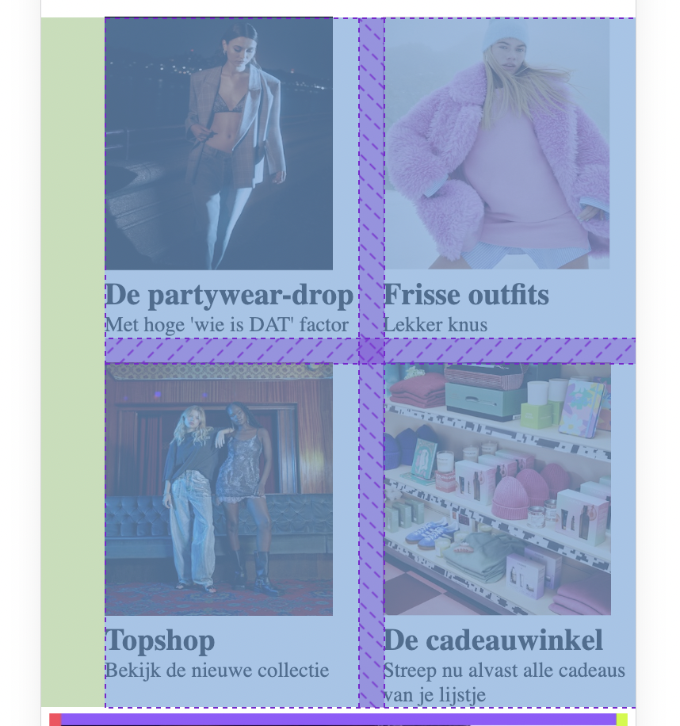 Ik heb een grid gemaakt met plaatjes, dit ging best makkelijk doordat ik hier aantekeningen van had gemaakt tijdens de uitleg. Op dit plaatje zie je dat de grid naar rechts staat. De grid neemt automatisch een margin aan. IK heb geprobeerd samen met de studentassistent om dit weg te halen maar dit is me niet gelukt. Ik heb het gepropbeerd door de padding, margin, align-items, en flexbox toe te passen. Uiteindelijk ben ik verder gaan werken omdat dit me niet is gelukt. 

  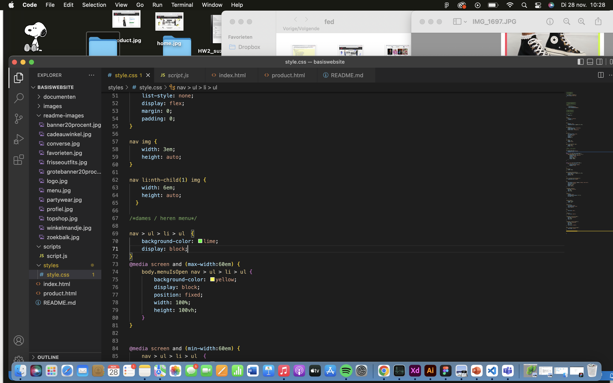 Nadat ik alle iconen in de nav had staan, ging ik een uitklapbaar menu maken. Doordat ik een hele grote nav had zag ik het overzicht niet meer en wist ik niet goed hoe ik zo'n menu bij mijn eigen site kon maken. In deze foto heb ik het blokje wat het uitklapbare dames en heren menu moest zijn op block gezet zodat ik deze beter kan onderscheiden van de rest en dan zag ik zitten waar die stond. Het uitklapbare menu bevat twee knoppen die weer een aparte li waren en zo kreeg ik een steeds grotere nav. 
  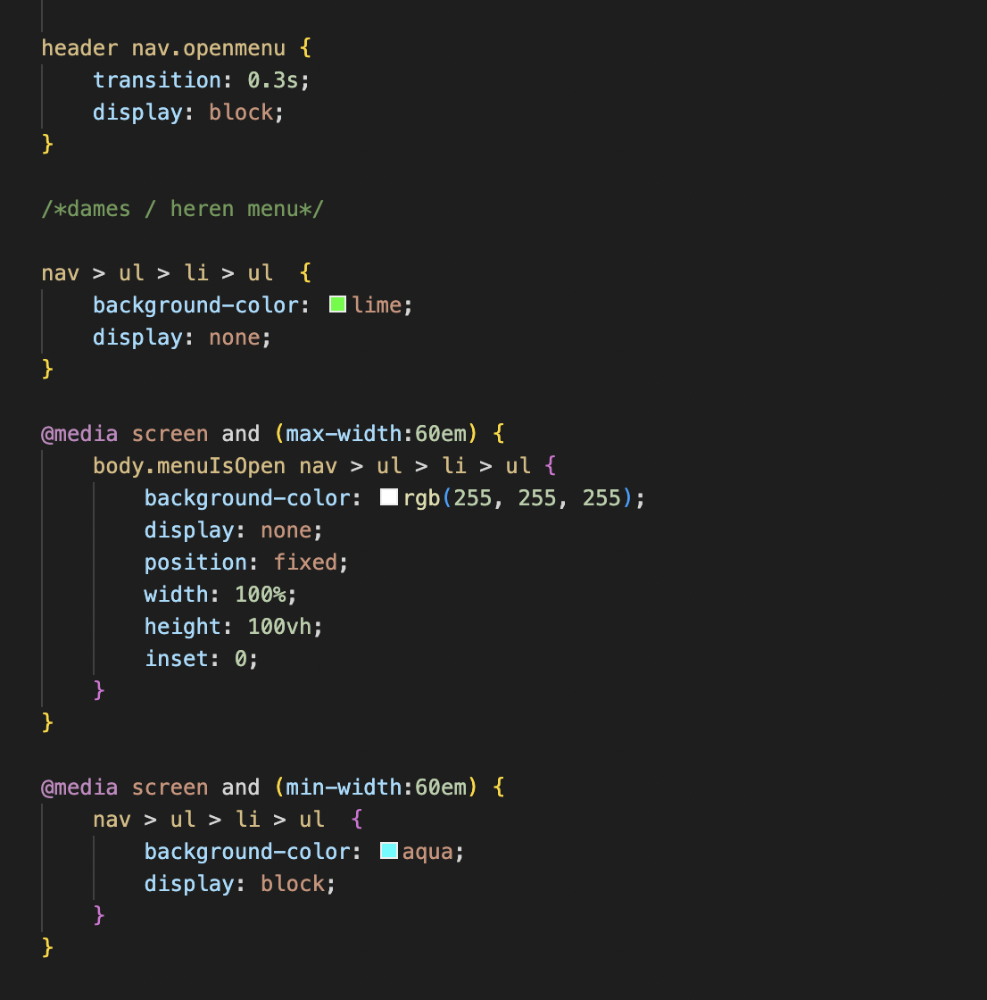 vaak werd er niet aangesproken wat ik bedoelde, ik heb heb geprobeerd haakjes tussen de code te zetten zodat deze meer specifiek werd en niet alles wordt aangesproken. 
  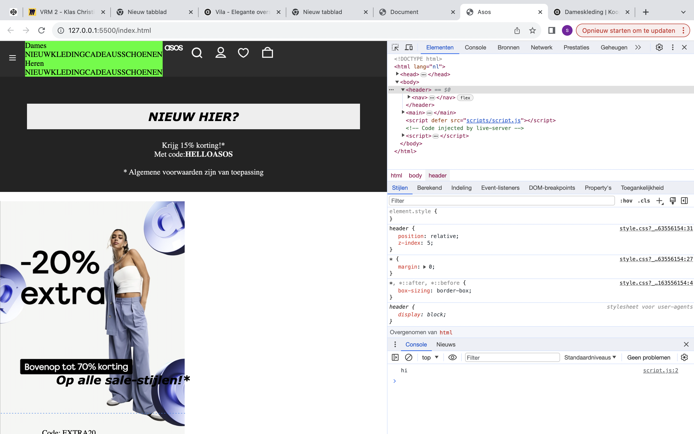Zo zag de nav eruit op een groot scherm, het blokje kwam in de header te staan en alle punten stonden naast elkaar, dit moest ik gaan positioneren. Met hulp van de docent omdat ik zelf het overzicht niet meer zag heb ik het menu werkend gekregen. Het eerste kind van de li waarin dames en heren stond heb ik op display block gezet zodat als je het menu opent deze er gelijk staat, over het heren menu moet je hoveren om de content daarbinnen te kunnen zien. 
  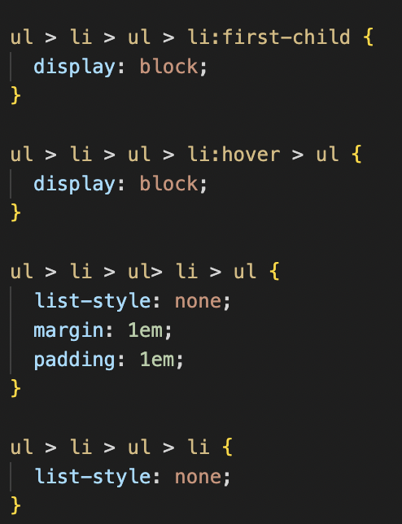 Dit werkte alleen maar voor het begin, toen heb ik gekeken waar dit mis ging door het eerste kind een kleur te geven, dit zou het dames menu moeten voorstellen. Ipv dat alle punten uit het dames menu een blauwe achtergrond kregen, kregen de eerste twee punten dat van het kopje dames en heren. Dit kleine probleem heb ik voor later gelaten. 
  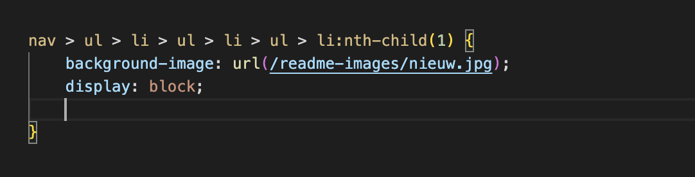Ik had geprobeerd een foto in een li te zetten zodat ik plaatjes kreeg in mijn menu. Ik zag gelijk al dat dit niet uitpakte hoe ik het bedoeld had en aangezien ik het menu net werkend had gekregen vond ik een kaal menu ook goed voor nu. Stel ik heb nog tijd over ga ik plaatjes toevoegen. 
  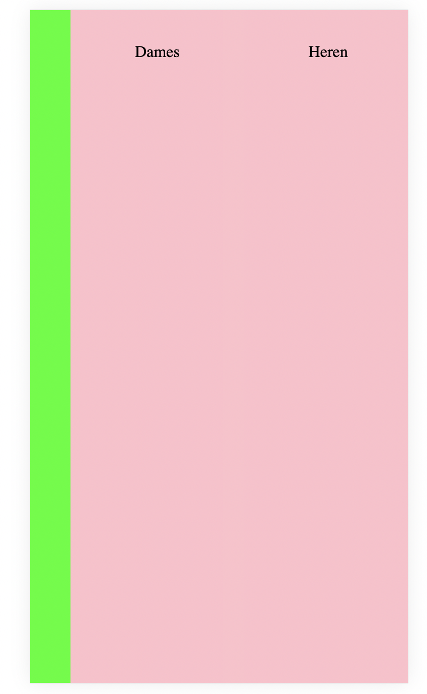 Ik merkte dat door een kleine toevoeging van een animatie alles verschoof, er was veel ruimte in mijn menu en in de nav. Door alle onderdelen een ander kleurtje te geven kwam ik erachter dat er iets mis was met de padding wat het plaatje van het kruis uit beeld drukt. Blijjbaar had ik een span op dames en heren gezet, in de header heb ik ook een span staan voor de animatie. Ik had een padding op nav span gezet waardoor alle spans in de nav een padding kregen. 
  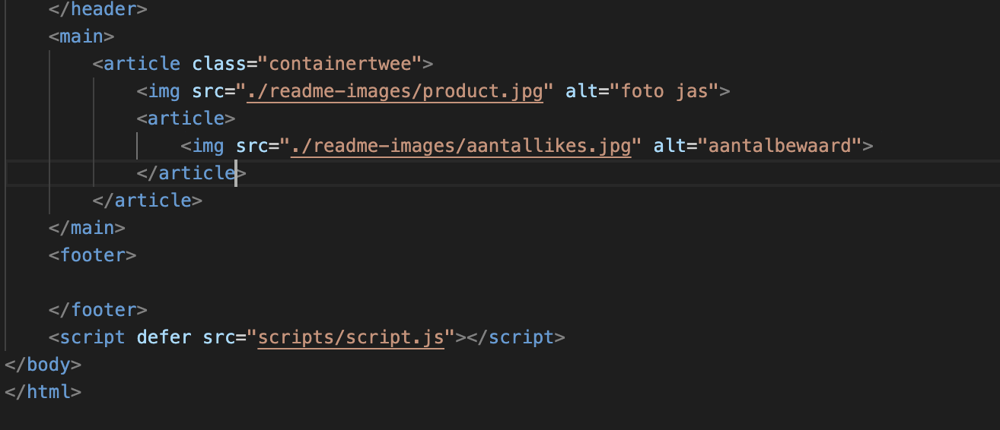 Ik had moeite met de stijling van mijn tweede pagina, ik heb met classes geprobeerd bepaalde sections er dan niet meer zo uit te laten zien. Dat werkte niet, als ik iets had aangesproken met nth-of-type dan kon ik het niet meer ongedaan maken met een class bij een andere section. Toen heb ik articles gebruikt op mijn tweede pagina, dit was niet echt de bedoeling dus ik moest een nieuwe manier bedenken. De studentassistent kwam met het idee om een class op de body te zetten en dan in de css de class aan te spreken en daarna een nth-of-type, dit werkte in de meeste gevallen. Toen werd het duidelijk voor mij dat je meerdere css pagina's mag aanmaken. Dit was veel makkelijker en overzichtelijker, ik heb toen mijn vorige code veranderd. 
  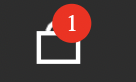 Op dlo stonden een aantal odprachten over animaties maken, deze heb ik gebruikt om mijn eigen animatie te maken. Zelf is de opzet van mijn nav vrij ingewikkeld dus was het niet heel makkelijk om dit op mijn pagina toe te passen. Toen wou ik een andere animatie gaan maken, dat het hartje gaat bewegen als je er op klikt. Het bleek dat je hiervoor veel frames nodig had met de animatie erop, ik ging maar verder met me eerdere plan. Als iemand op de 'in winkelwagen' button klikt moet er een getal komen bij het icoon van de winkelwagen. Met wat tutorials te hebben gekeken had ik een idee hoe ik dit kon doen. Toen ik het ging uitvoeren merkte ik dat die elementen die ik probeerde aan te spreken niet aangesproken werden. Ik heb het toen aan chatGPT gevraagd en met een beetje hulp zag ik de fout in, ik had mijn code weer niet specifiek genoeg gemaakt. Uiteindelijk ben ik erg trots op mijn animatie. 

  

  ### Stand van zaken
  hier dit ging goed & dit was lastig (neem ook screenshots op van delen van je website en code)

  ### Agenda voor meeting
  samen met je groepje opstellen

  | student 1      | student 2          | student 3    | student 4        |
  | ---            | ---                | ---          | ---              |
  | dit bespreken  | en dit             | en ik dit    | en dan ik dat    |
  | en dat ook nog | dit als er tijd is | nog een punt | dit wil ik zeker |
  | ...            | ...                | ...          | ...              |

  ### Verslag van meeting
  hier na afloop snel de uitkomsten van de meeting vastleggen

  - punt 1
  - punt 2
  - nog een punt
- ...

## Toegankelijkheidstest 2/2 (week 4)

  
uitwerken na test in 9e werkgroep

  ### Bevindingen
  Lijst met je bevindingen die in de test naar voren kwamen (geef ook aan wat er verbeterd is):

## Voortgang 3 (week 4)

  
uitwerken voor 3e voortgang

  Deze week wou ik me gaan focussen op alles responsive maken. 

  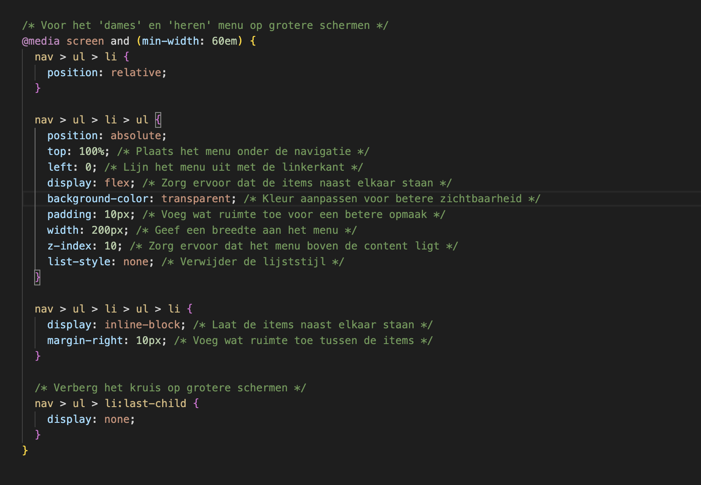 Ik wou het menu responsive hebben voor op een groot scherm, want nu als ik het scherm groter maak komt er een blauw blokje in de nav. Het menu die ik probeer te maken die hoort onder de navigatiebalk te staan op een groter scherm. Met wat research heb deze manier van een media query gebruiken een beetje leren kennen, dit snap ik nu beter. 
  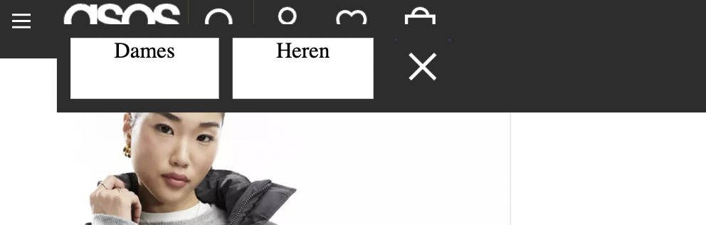het menublokje staat half op de navigatie balk maar ik vond het toch een goede poging. Door de width aan te passen werd het aan de rechterkant een balk. Ik heb het kruis proberen weg te krijgen door het laatste kind een display none te geven, toen had ik de code specifieker gemaakt met de button ook nog te benoemen en de laatste poging was om important erachter te zetten. Deze pogingen werkte allemaal niet en ik heb het kruis maar laten staan. 
  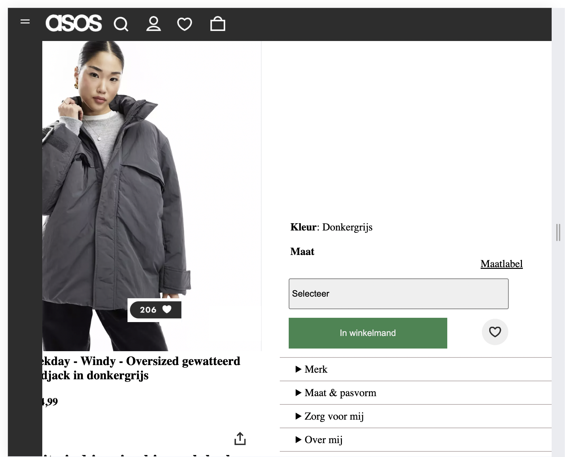 Op de site zelf het menu er op een bepaald punt zo uit, dat is de menubalk die op een later breakpoint onder de nav komt. Ik weet niet hoe ik dit hier weg krijg, ik heb het breakpoint nog proberen te verandedren maar dat maakt geen verschil in dit beeld.
  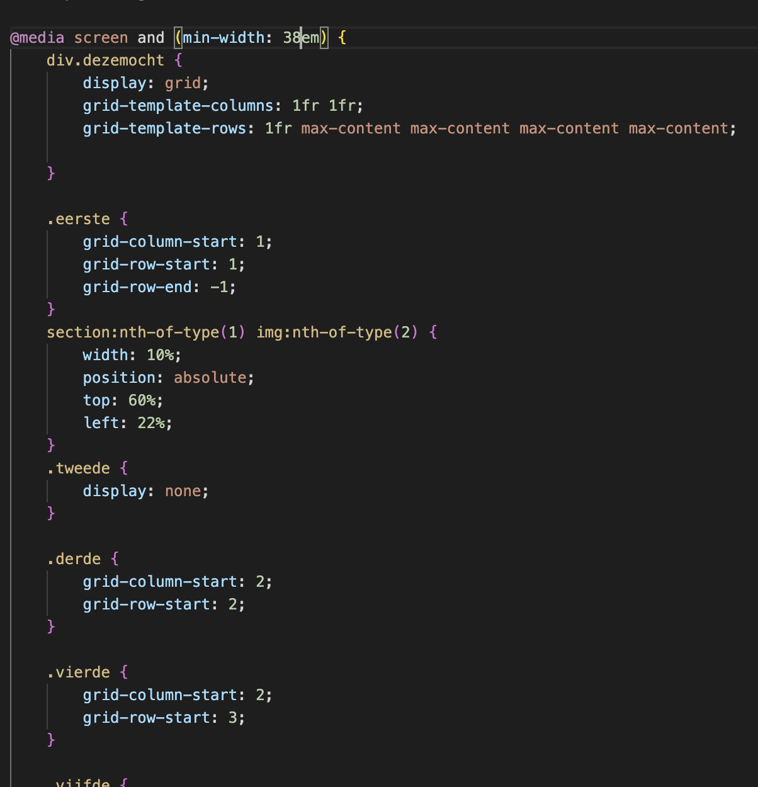 De tweede pagina wou ik ook repsonsive hebben, ik had twee colommen nodig om bepaalde sections naast elkaar te zetten. Met hulp van de docent heb ik een grid gemaakt. Om alles op de goede plek te zetten heb ik classes gebruikt op de verschillende sections. Ook mocht ik een div aanmaken zodat ik de grid beter kon aanspreken. Het kleinere plaatje wat het aantal likes bevat staat in dezelfde section als het grote plaatje maar deze heeft de position absolute. Ik heb in de media query deze maten veranderd voor een groot scherm zodat het plaatje meegaat met het andere plaatje. 

  ### Stand van zaken
  hier dit ging goed & dit was lastig (neem ook screenshots op van delen van je website en code)

  ### Agenda voor meeting
  samen met je groepje opstellen

  | student 1      | student 2          | student 3    | student 4        |
  | ---            | ---                | ---          | ---              |
  | dit bespreken  | en dit             | en ik dit    | en dan ik dat    |
  | en dat ook nog | dit als er tijd is | nog een punt | dit wil ik zeker |
  | ...            | ...                | ...          | ...              |

  ### Verslag van meeting
  hier na afloop snel de uitkomsten van de meeting vastleggen

  - punt 1
  - punt 2
  - nog een punt
  - ...

## Eindgesprek (week 5)

  
uitwerken voor eindgesprek

  ### Je uitkomst - karakteristiek screenshots:
  

  ### Dit ging goed/Heb ik geleerd: 
  Korte omschrijving met plaatjes

  

  ### Dit was lastig/Is niet gelukt:
  Korte omschrijving met plaatjes

  

## Bronnenlijst

  
continu bijhouden terwijl je werkt

  Nb. Wees specifiek ('css-tricks' als bron is bijv. niet specifiek genoeg). 
  Nb. ChatGpT en andere AI horen er ook bij.
  Nb. Vermeld de bronnen ook in je code.

  1. bron 1
  2. bron 2
  3. ...

