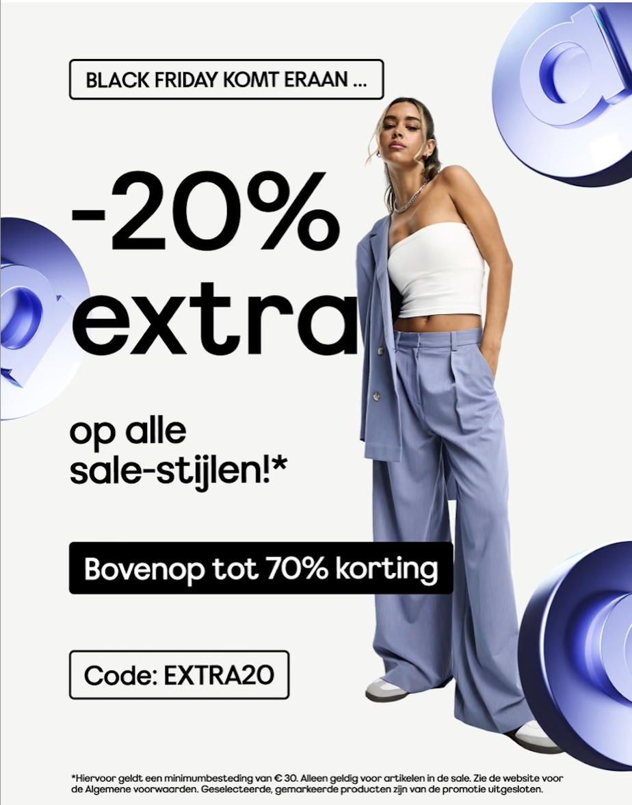

# Procesverslag
Markdown is een simpele manier om HTML te schrijven.  
Markdown cheat cheet: [Hulp bij het schrijven van Markdown](https://github.com/adam-p/markdown-here/wiki/Markdown-Cheatsheet).

Nb. De standaardstructuur en de spartaanse opmaak van de README.md zijn helemaal prima. Het gaat om de inhoud van je procesverslag. Besteedt de tijd voor pracht en praal aan je website.

Nb. Door *open* toe te voegen aan een *details* element kun je deze standaard open zetten. Fijn om dat steeds voor de relevante stuk(ken) te doen.

## Jij

  
uitwerken voor kick-off werkgroep

  ### Auteur:
  Suze Kersbergen

  #### Je startniveau:
  blauw 

  #### Je focus:
  responsive
 

## Je website

  
uitwerken voor kick-off werkgroep

  ### Je opdracht:
  https://www.asos.com/nl/dames/ 

  #### Screenshot(s) van de eerste pagina (small screen): 
  hier de naam van de pagina  
  
  Dit is de homepage van Asos, een website die heel veel kleding, accesoires en schoenen verkoopt. De site is bekend en ik vond deze site geschikt door de variatie van de content. 

  #### Screenshot(s) van de tweede pagina (small screen):
  hier de naam van de pagina  
  
  De pagina is de omschijving van een bepaald product, ik zal waarschijnlijk niet de pagina van dit exacte product gebruiken maar de content is op elke productpagina hetzelfde. 
 

## Toegankelijkheidstest 1/2 (week 1)

  
uitwerken na test in 2e werkgroep

  Ik heb de site door een validator gehaald, de validator gaf al gelijk een error aan dat het niet mogelijk was om de site te checken. Uiteindelijk is dit wel gelukt door de code direct in de validator te plakken. 

  ### Bevindingen
  Lijst met je bevindingen die in de test naar voren kwamen:
  - De code bevat meer dan 700 errors, veel dezelfde fouten worden gemaakt zoals een alt tekst die ontbreekt of een div verkeerd gebruikt.
  - De site heeft een knop waarmee je kan skippen tot de inhoud, dit is handig voor een screenreader. Ook was deze functie niet makkelijk te vinden en kwam ik hier perongeluk op.
  - De menu is erg groot en heel lastig om met een screenreader doorheen te gaan. 
  - Af en toe slaat de screenreader een onderdeel over dus zullen deze elementen waarschijnlijk geen alt tekst bevatten.

 
  
  

## Breakdownschets (week 1)

  
uitwerken na afloop 3e werkgroep

  ### de hele pagina: 
  
  Op de pagina is er veel dezelfde content te zien, ik wil elk deel er wel inzitten maar in verminder de hoeveelheid van bijvoorbeeld een lijst.

  ### dynamisch deel (bijv menu): 
  

  ### wellicht nog een dynamisch deel (bijv filter): 
  

## Voortgang 1 (week 2)

  
uitwerken voor 1e voortgang

  ### Stand van zaken
   Deze week ben ik begonnen met mijn html document. Ik merkte dat veel van de stof van vorig jaar was weggezakt zoals hoe de tags ook alweer heten. Ik begon met de header, met wat hulp kon ik de stof weer naar boven halen. De tweede les kreeg ik de header af en hier was ik erg blij mee. De iconen heb ik gelinkt naar de productpagina 
  
  Ik heb deze week eerst orde in mijn hoofd gecreeërd door eerst foto's van elk blok in de code te zetten. Zo weet ik welk gedeelte waar moet komen. Het eerste en tweede blokje heb ik deze week kunnen uitwerken. Het plaatje van het tweede blokje heb een beetje gephotoshopt, zodat ik zelf de teksten met code erin kon zetten. De teksten die overlapte met het model op de foto heb ik erin gehouden omdat ik deze lastig kan wegwerken. 

  
  
  
  
  Ik had nog nooit gewerkt met first-of-type, nth-of-type en child. Ik heb in mijn vorige projecten veel met classes gewerkt maar omdat het niet de bedoeling is dat je er daar veel van gebruikt, vond ik het wel handig om te leren. Met aantekeningen maken en hulp van klasgenoten is het gelukt. In de code hieronder zie je dat ik dit heb toegepast om twee sections aan te spreken.

  

  ### Agenda voor meeting
  samen met je groepje opstellen

  | student 1      | student 2          | student 3    | student 4        |
  | ---            | ---                | ---          | ---              |
  | dit bespreken  | en dit             | en ik dit    | en dan ik dat    |
  | en dat ook nog | dit als er tijd is | nog een punt | dit wil ik zeker |
  | ...            | ...                | ...          | ...              |

  ### Verslag van meeting
  hier na afloop snel de uitkomsten van de meeting vastleggen

  - punt 1
  - punt 2
  - nog een punt
  - ...

## Voortgang 2 (week 3)

  
uitwerken voor 2e voortgang

  ### Stand van zaken
  hier dit ging goed & dit was lastig (neem ook screenshots op van delen van je website en code)

  ### Agenda voor meeting
  samen met je groepje opstellen

  | student 1      | student 2          | student 3    | student 4        |
  | ---            | ---                | ---          | ---              |
  | dit bespreken  | en dit             | en ik dit    | en dan ik dat    |
  | en dat ook nog | dit als er tijd is | nog een punt | dit wil ik zeker |
  | ...            | ...                | ...          | ...              |

  ### Verslag van meeting
  hier na afloop snel de uitkomsten van de meeting vastleggen

  - punt 1
  - punt 2
  - nog een punt
- ...

## Toegankelijkheidstest 2/2 (week 4)

  
uitwerken na test in 9e werkgroep

  ### Bevindingen
  Lijst met je bevindingen die in de test naar voren kwamen (geef ook aan wat er verbeterd is):

## Voortgang 3 (week 4)

  
uitwerken voor 3e voortgang

  ### Stand van zaken
  hier dit ging goed & dit was lastig (neem ook screenshots op van delen van je website en code)

  ### Agenda voor meeting
  samen met je groepje opstellen

  | student 1      | student 2          | student 3    | student 4        |
  | ---            | ---                | ---          | ---              |
  | dit bespreken  | en dit             | en ik dit    | en dan ik dat    |
  | en dat ook nog | dit als er tijd is | nog een punt | dit wil ik zeker |
  | ...            | ...                | ...          | ...              |

  ### Verslag van meeting
  hier na afloop snel de uitkomsten van de meeting vastleggen

  - punt 1
  - punt 2
  - nog een punt
  - ...

## Eindgesprek (week 5)

  
uitwerken voor eindgesprek

  ### Je uitkomst - karakteristiek screenshots:
  

  ### Dit ging goed/Heb ik geleerd: 
  Korte omschrijving met plaatjes

  

  ### Dit was lastig/Is niet gelukt:
  Korte omschrijving met plaatjes

  

## Bronnenlijst

  
continu bijhouden terwijl je werkt

  Nb. Wees specifiek ('css-tricks' als bron is bijv. niet specifiek genoeg). 
  Nb. ChatGpT en andere AI horen er ook bij.
  Nb. Vermeld de bronnen ook in je code.

  1. bron 1
  2. bron 2
  3. ...

